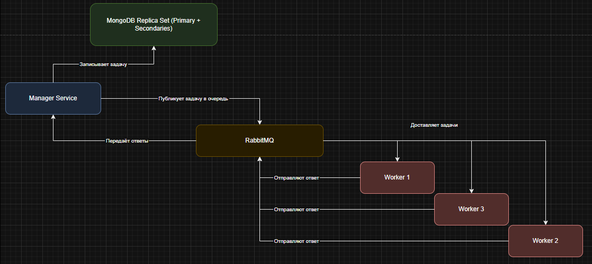

# CrackHash

Это приложение позволяет осуществлять подбор строк по-заданному MD5-хэшу. Пользователь указывает хэш и максимальную длину генерируемых строк. Система перебирает все возможные комбинации с длиной от 1 до указанного предела и возвращает найденное совпадение или пустой результат, если совпадений не найдено.

## Основные возможности

- **Отправка задачи:** Передаётся хэш и максимальная длина искомой строки.
- **Проверка статуса задачи:** Позволяет получить статус выполнения и найденные данные.

## Архитектура



## Draw.io

See [arch.drawio](./.assets/CrackHashv2Diagram.drawio)

## Как пользоваться

### 1. Отправка задачи на подбор строки

Отправьте HTTP POST запрос по адресу:

```
http://localhost:8080/api/hash/crack
```

В теле запроса в формате JSON передаются параметры:
- `hash` — MD5-хэш строки, которую необходимо подобрать.
- `maxLength` — максимальная длина генерируемых комбинаций.

**Пример запроса:**

```cmd
curl -X POST -H "Content-Type: application/json" -d "{\"hash\":\"0cc175b9c0f1b6a831c399e269772661\", \"maxLength\":1}" http://localhost:8080/api/hash/crack
```

В ответ вы получите идентификатор задачи:

```json
{"requestId":"<some-uuid>"}
```

### 2. Проверка статуса задачи

После отправки задачи, подождите несколько секунд и выполните GET-запрос для получения статуса:

```
http://localhost:8080/api/hash/status?requestId=<ВАШ_REQUEST_ID>
```

**Пример запроса:**

```cmd
curl "http://localhost:8080/api/hash/status?requestId=<ВАШ_REQUEST_ID>"
```

В ответ придёт JSON с информацией о статусе выполнения (`PENDING` или `READY`) и результатом подбора:

- Если задача выполнена успешно, статус станет `READY` и в поле `data` будет найденное слово.
- Если совпадение не найдено, `data` будет пустым массивом.

## Примеры использования

### Пример 1. Поиск простого слова «a» (maxLength = 1)

**Отправка задачи:**

```cmd
curl -X POST -H "Content-Type: application/json" -d "{\"hash\":\"0cc175b9c0f1b6a831c399e269772661\", \"maxLength\":1}" http://localhost:8080/api/hash/crack
```

**Проверка статуса:**

```cmd
curl "http://localhost:8080/api/hash/status?requestId=<ВАШ_REQUEST_ID>"
```

**Ожидаемый результат:**

```json
{"status":"READY","data":["a"]}
```

---

### Пример 2. Поиск слова, отсутствующего в пространстве (maxLength = 3)

**Отправка задачи:**

```cmd
curl -X POST -H "Content-Type: application/json" -d "{\"hash\":\"098f6bcd4621d373cade4e832627b4f6\", \"maxLength\":3}" http://localhost:8080/api/hash/crack
```

**Проверка статуса:**

```cmd
curl "http://localhost:8080/api/hash/status?requestId=<ВАШ_REQUEST_ID>"
```

**Ожидаемый результат:** Статус `READY`, но массив `data` будет пустым.

```json
{"status":"READY","data":[]}
```

---

### Пример 3. Поиск слова «abc» (maxLength = 4)

Хэш для строки «abc»:

```
900150983cd24fb0d6963f7d28e17f72
```

**Отправка задачи:**

```cmd
curl -X POST -H "Content-Type: application/json" -d "{\"hash\":\"900150983cd24fb0d6963f7d28e17f72\", \"maxLength\":4}" http://localhost:8080/api/hash/crack
```

**Проверка статуса:** Подождите 30 секунд или чуть больше, затем:

```cmd
curl "http://localhost:8080/api/hash/status?requestId=<ВАШ_REQUEST_ID>"
```

**Ожидаемый результат:** Если всё прошло успешно, в поле `data` отобразится найденное слово.

```json
{"status":"READY","data":["abc"]}
```

---

### Пример 4. Поиск слова «abc» при ограничении maxLength = 2

В этом примере система не сможет подобрать слово «abc», так как максимальная длина комбинации слишком мала.

**Отправка задачи:**

```cmd
curl -X POST -H "Content-Type: application/json" -d "{\"hash\":\"900150983cd24fb0d6963f7d28e17f72\", \"maxLength\":2}" http://localhost:8080/api/hash/crack
```

**Проверка статуса:**

```cmd
curl "http://localhost:8080/api/hash/status?requestId=<ВАШ_REQUEST_ID>"
```

**Ожидаемый результат:** Статус `READY` и пустой массив `data`.

```json
{"status":"READY","data":[]}
```